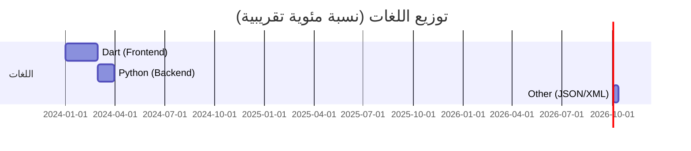

# 🌾 مشروع الإحصاء الفلاحي (Agricultural Census)

  

## 📊 إحصائيات المشروع (Project Statistics)

### 📈 توزيع اللغات (Language Distribution)

> [!NOTE]
> المخطط أعلاه يوضح توزيع المجهود البرمجي بين واجهة المستخدم والخلفية.

### 📂 إحصائيات الملفات
- **عدد الملفات البرمجية الأساسية:** ~1,500 ملف (Dart & Python).
- **إجمالي الملفات (مع المصادر):** أكثر من 8,000 ملف.

## 🎨 تصميم الواجهة
تم اختيار تدرجات **اللون الأخضر** لتعكس الهوية الزراعية للمشروع:
- **الأخضر الغامق (#006400):** للشرائط العلوية والأزرار الأساسية.
- **الأخضر الفاتح:** للخلفيات والقوائم الفرعية.

---
*هذا المستودع يمثل المشروع الكامل للإحصاء الفلاحي 2026.*
