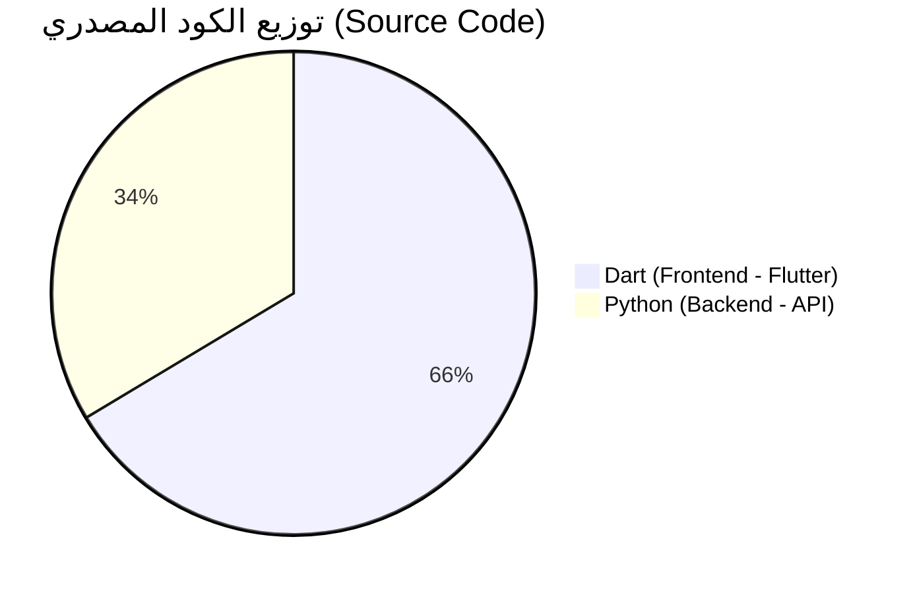

# 📊 إحصائيات المشروع الحقيقية (Real Statistics)

### 🥧 مخطط نسب لغات البرمجة (Pie Chart)


### 📂 تفاصيل الملفات
- **إجمالي ملفات الكود البرمجي:** 122 ملفاً.
- **إجمالي ملفات المشروع:** حوالي 300 ملفاً.

---

## 🌐 طريقة تشغيل المشروع في متصفح كروم (Chrome)

لرؤية نتيجة التطبيق وتجربته داخل المتصفح، اتبع الخطوات التالية:

### 1. المتطلبات الأساسية
- تأكد من تثبيت **Flutter SDK** على جهازك.
- تأكد من وجود متصفح **Google Chrome**.

### 2. تشغيل واجهة التطبيق (Frontend)
افتح التيرمينال داخل مجلد `frontend` ونفذ الأمر التالي:
```bash
flutter run -d chrome
```

### 3. تشغيل الخادم (Backend)
افتح التيرمينال داخل مجلد `backend` ونفذ الأوامر التالية:
```bash
pip install -r requirements.txt
python main.py
```

---
*ملاحظة: نسخة الويب قد تختلف برمجياً عن نسخة الهاتف في التعامل مع قاعدة البيانات المحلية.*
