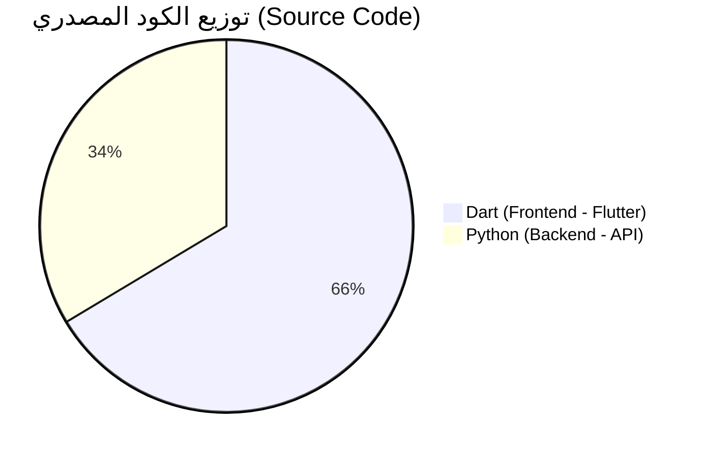

# 📊 إحصائيات المشروع الحقيقية (Real Statistics)

### 🥧 مخطط نسب لغات البرمجة (Pie Chart)

### 📂 تفاصيل الملفات
- **إجمالي ملفات الكود البرمجي:** 122 ملفاً.
- **إجمالي ملفات المشروع:** حوالي 300 ملفاً.

---
*هذا المستودع مخصص لحفظ الكود المصدري للمشروع.*
