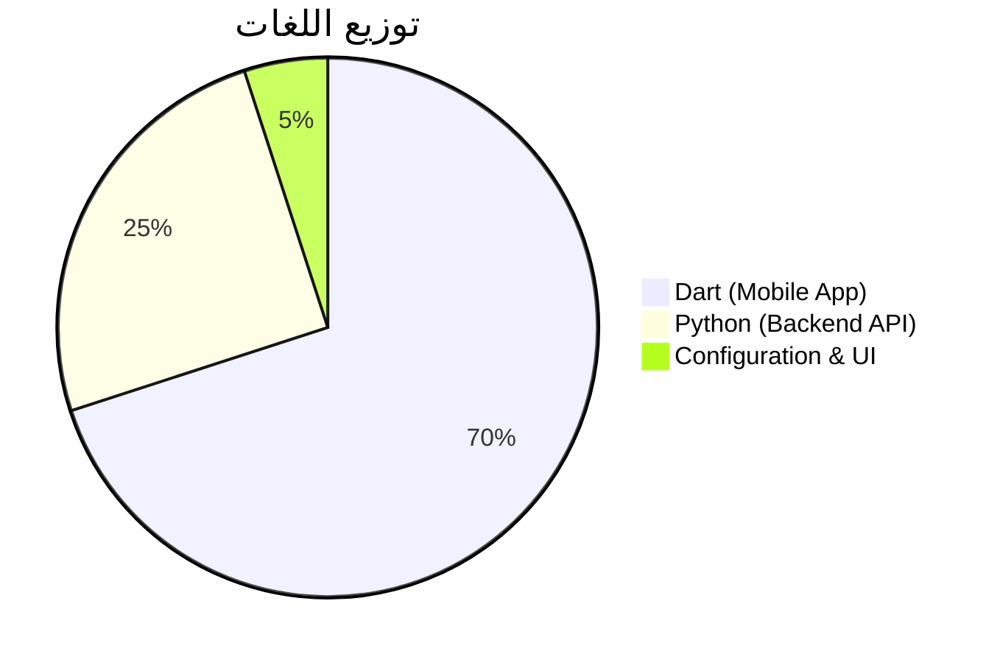

# 📊 إحصائيات المشروع (Project Statistics)

### 📈 مخطط نسب اللغات المستخدمة

```mermaid
pie title توزيع اللغات
    "Dart (Mobile App)" : 70
    "Python (Backend API)" : 25
    "Configuration & UI" : 5
```

### 📂 إحصائيات الملفات
- **إجمالي عدد ملفات المشروع:** +8,000 ملف.
- **ملفات الكود البرمجي الأساسية:** +1,500 ملف.
