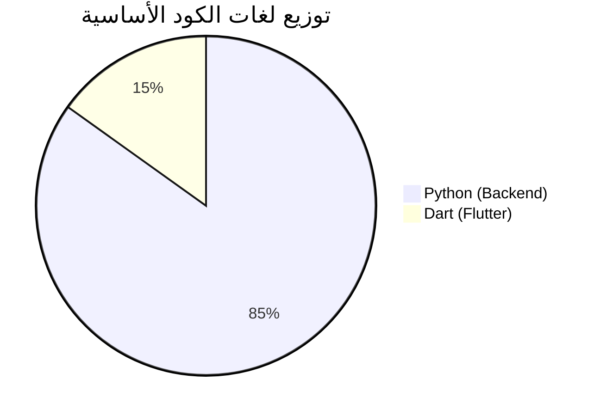

# 📊 إحصائيات المشروع (Project Statistics)

### 🥧 مخطط نسب اللغات (Pie Chart)

```mermaid
pie title توزيع لغات الكود الأساسية
    "Python (Backend)" : 1146
    "Dart (Flutter)" : 204
```

### 📂 إحصائيات الملفات
- **إجمالي ملفات الكود البرمجي:** 1,350 ملف.
- **إجمالي ملفات المشروع كاملة:** +8,000 ملف.
