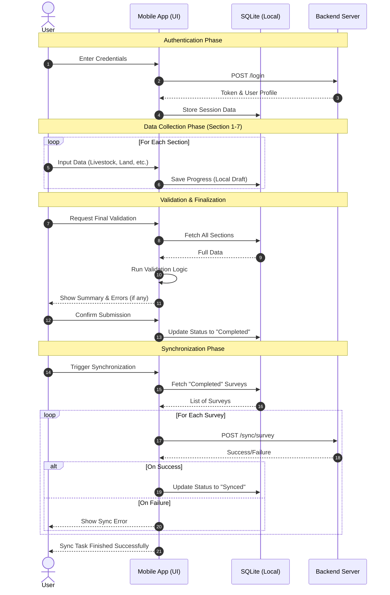

# Global Sequence Diagram - Agricultural Census (RGA)

This document contains the global sequence diagram for the RGA application, illustrating the complete workflow from authentication to data synchronization.

## Mermaid Code

## Description of Workflow

1.  **Authentication**: The user logs in to the application. Credentials are verified against the backend server, and a session is created locally in SQLite.
2.  **Data Collection**: The user fills out the 7 sections of the agricultural census. Each step is saved locally in the SQLite database to prevent data loss.
3.  **Validation**: Before submission, the app performs a comprehensive check of all required fields and business rules. A summary is presented to the user for final review.
4.  **Finalization**: Once confirmed, the survey status is changed to "Completed" in the local database.
5.  **Synchronization**: The user can sync completed surveys with the central server when an internet connection is available. The app sends the data to the API and updates the local status to "Synced" upon success.
