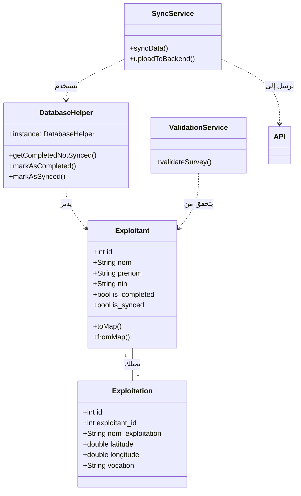

# مخطط الأصناف (Class Diagram) - بنية البيانات

يوضح هذا المخطط العلاقة بين العناصر الأساسية في قاعدة البيانات والخدمات.

```mermaid
classDiagram
    class Exploitant {
        +int id
        +String nom
        +String prenom
        +String nin
        +bool is_completed
        +bool is_synced
        +toMap()
        +fromMap()
    }

    class Exploitation {
        +int id
        +int exploitant_id
        +String nom_exploitation
        +double latitude
        +double longitude
        +String vocation
    }

    class DatabaseHelper {
        +instance: DatabaseHelper
        +getCompletedNotSynced()
        +markAsCompleted()
        +markAsSynced()
    }

    class SyncService {
        +syncData()
        +uploadToBackend()
    }

    class ValidationService {
        +validateSurvey()
    }

    Exploitant "1" -- "1" Exploitation : يمتلك
    DatabaseHelper ..> Exploitant : يدير
    SyncService ..> DatabaseHelper : يستخدم
    SyncService ..> API : يرسل إلى
    ValidationService ..> Exploitant : يتحقق من
```
