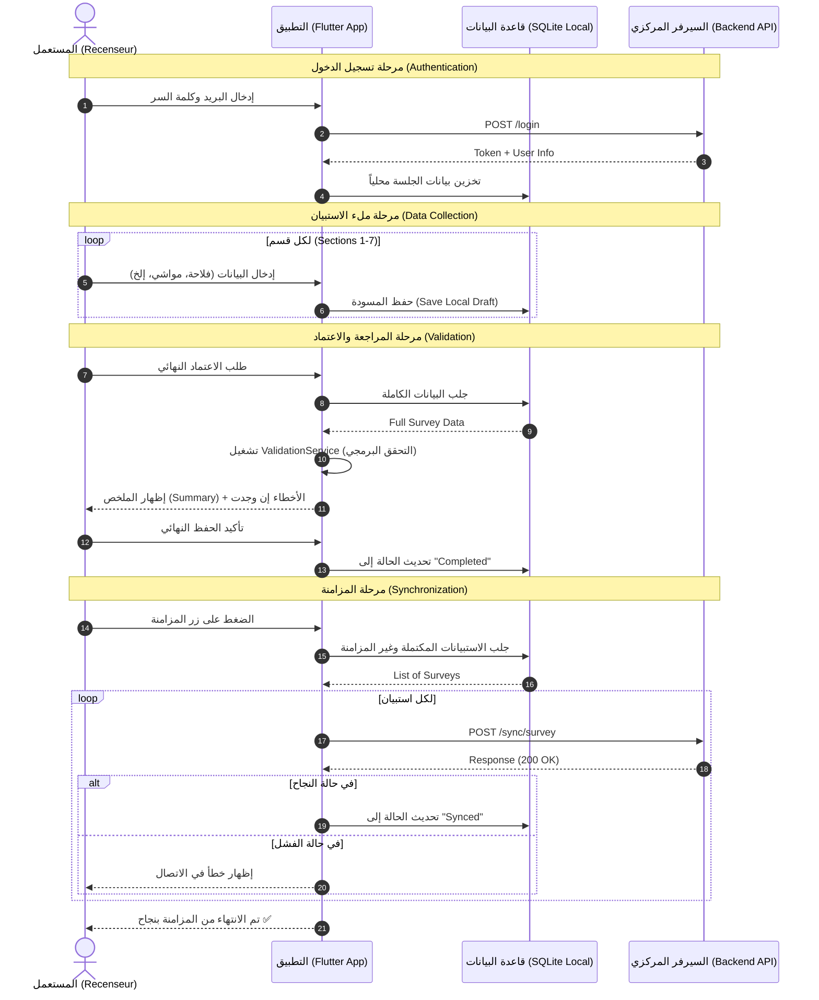

# مخطط التتابع الشامل للتطبيق (Global Sequence Diagram)

هذا الملف يحتوي على الكود والرسم البياني لتدفق البيانات في التطبيق من البداية وحتى المزامنة.

## شرح المخطط:
1. **المزامنة:** يتم إرسال البيانات فقط عند توفر الإنترنت، مع تحديث الحالة في قاعدة البيانات المحلية.
2. **الأمان:** يتم تخزين التوكن محلياً لتفادي تسجيل الدخول في كل مرة.
3. **الدقة:** يتم التحقق من البيانات برمجياً (Validation) قبل إرسالها للسيرفر لضمان جودة الإحصاء.
